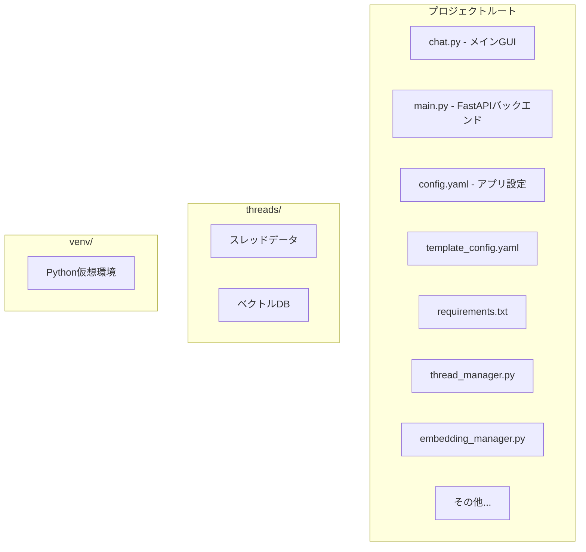
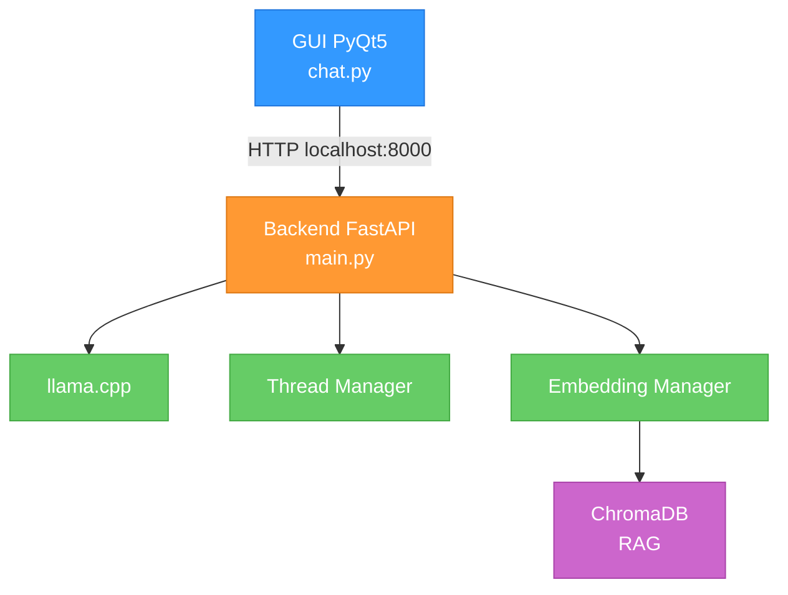

# Local-AI-Chat

ローカルLLMを使用した、完全プライベートなAIチャットアプリケーション

## 目次

- [概要](#概要)
- [特徴](#特徴)
- [スクリーンショット](#スクリーンショット)
- [必要環境](#必要環境)
- [インストール手順](#インストール手順)
- [設定ガイド](#設定ガイド)
- [トラブルシューティング](#トラブルシューティング)
- [開発者向け情報](#開発者向け情報)
- [ライセンス](#ライセンス)

## 概要

このアプリケーションは、ローカル環境で動作するLLM（大規模言語モデル）を使用したチャットアプリケーションです
全てのデータがローカルに保存され、インターネット接続なしで動作するため、プライバシーを完全に保護できます

---注意---
このプロジェクトは、コーディングからこのREADMEまでほぼ全てをAIを積極的に活用して作成しています
人間側は発案、相談、デバッグ、微調整等、主にAIに対してわがままを言う分野しか担当しておりません

そのため、製作者として名前は載せていますが、一般的な開発者のように全ての実装内容を完全に把握しているわけではありません
高度な質問や個別環境でのトラブル対応には答えられない場合があります

ある程度、自分で調べる・AIにエラーメッセージを投げる・試行錯誤する前提で使っていただける方向けです
予めご容赦ください

## 特徴

- ✅ **完全ローカル実行**: 全てのデータをローカルに保存
- ✅ **スレッド管理**: 複数の会話を整理して管理
- ✅ **RAG（検索拡張生成）**: 過去の会話を参照して回答を生成
- ✅ **グループ機能**: スレッドをグループ分けして整理
- ✅ **キャラクター画像**: お気に入りのキャラクター画像を設定可能
- ✅ **自動タイトル生成**: 会話内容から自動的にスレッドタイトルを生成
- ✅ **ピン留め機能**: 重要なスレッドを上部に固定

## スクリーンショット

（後で追加）

## 必要環境

### ハードウェア要件

#### 最小構成
- **CPU**: x86_64アーキテクチャ
- **RAM**: 16GB以上
- **ストレージ**: 20GB以上の空き容量

#### 推奨構成
- **GPU**: NVIDIA GPU
  - 使用するLLMによって変わりますがVRAMは16GB以上推奨
- **RAM**: 32GB以上
- **ストレージ**: SSD 50GB以上

### ソフトウェア要件

- **OS**: Linux（Ubuntu 22.04以上推奨）/ Windows 10/11 / macOS
- **Python**: 3.12以上
- **CUDA Toolkit**: 12.x（GPU使用時）
- **Git**: 2.x以上

## インストール手順

### 1. リポジトリのクローン

```bash
git clone https://github.com/ryo356works/local-ai-chat.git
cd local-ai-chat
```

### 1.5 初回インストールスクリプト

同梱されている./setup.sh(Linux)またはsetup.bat(Windows)を実行すると以下2.3.を自動化出来ます
必要に応じて利用してください

linuxをお使いの場合は以下のファイルに実行権限の付与が必要かもしれません
```bash
chmod +x setup.sh start.sh install_cuda.sh
```

### 2. 仮想環境の作成

```bash
python3 -m venv venv
source venv/bin/activate  # Linux/macOS
# または
venv\Scripts\activate  # Windows
```

### 3. 依存関係のインストール

```bash
pip install --upgrade pip
pip install -r requirements.txt
```

### 4. llama-cpp-pythonのインストール

GPU（NVIDIA）を使用する場合、CUDA対応版のllama-cpp-pythonをインストールします。

**簡単インストール（推奨）**:
```bash
# Linux/macOS
./install_cuda.sh

# Windows
install_cuda.bat
```

**手動インストール**:
```bash
# 仮想環境をアクティベート
source venv/bin/activate  # Linux/macOS
venv\Scripts\activate     # Windows

# 必ず仮想環境内で実行してください
# CUDA対応でインストール
CMAKE_ARGS="-DLLAMA_CUDA=on" pip install llama-cpp-python --force-reinstall --no-cache-dir
```

**注意**: CUDA Toolkitが事前にインストールされている必要があります。

### 5. LLMモデルのダウンロード

Hugging Faceから好みのGGUFモデルをダウンロードします
特定のモデルを例に出したくないのでコマンド等は省略します
LLMとのやり取りにllama-cpp-pythonを使っていますのでgguf形式のモデルを用意してください

### 5. 設定ファイルの編集

編集前に`config.yaml`のバックアップを取る：

```bash
cp config.yaml config.yaml.back  # バックアップ（オプション）
```

`config.yaml`を開いて、最低限以下を設定：

```yaml
llm:
  model_path: "/path/to/your/model.gguf"  # ダウンロードしたモデルのパス
```

### 6. 起動方法

**Linux/macOS**
```bash
# 初回のみ
./setup.sh

# 起動コマンド
./start.sh
```

**Windows**
```batch
REM 初回のみ
setup.bat

REM 起動コマンド
start.bat
```

起動時、バックエンドが自動的に起動します（10〜20秒かかります）

## 設定ガイド

### config.yaml の構成

```yaml
# UI設定
ui:
  font_family: "Noto Sans CJK JP"   # フォント名
  font_size: 15                     # 全体のフォントサイズ
  input_font_size: 15               # 入力欄のフォントサイズ
  user_message_color: "#2d5f8d"     # ユーザーメッセージの背景色
  ai_message_color: "#3a3a3a"       # AIメッセージの背景色
  verbose: false                    # デバッグログ（true: 詳細ログ出力, false: エラー・警告・重要情報のみ）

# LLM設定
llm:
  model_path: "/path/to/model.gguf" # モデルファイルのパス（必須）
  n_gpu_layers: -1                  # GPU使用層数（-1: 全層, 0: CPU only）
  n_ctx: 8192                       # コンテキストサイズ
  n_batch: 512                      # バッチサイズ

# Embedding設定（RAG機能）
embedding:
  enabled: true                     # RAG機能の有効/無効
  model_name: "BAAI/bge-m3"         # Embeddingモデル
  db_url: ""                        # 空白ならローカルChromaDBが自動で使用されます（enabled: trueの場合のみ）
  chunk_size: 6                     # チャンクサイズ（いくつ発言をまとめるか）
```

### 各設定項目の詳細

#### UI設定

- **font_family**: システムにインストールされているフォント名
  - Linux: `fc-list`コマンドで確認可能
  - Windows: コントロールパネル → フォント

相対パスも使用できるのでDLしたフォントも利用できます
例:fontsディレクトリを作成してそこにNotoSansJP-Regular.ttfをDLした場合
  font_family: "fonts/NotoSansJP-Regular.ttf"

#### LLM設定

- **model_path**: GGUFモデルファイルへの絶対パスまたは相対パス
- **n_gpu_layers**: 
  - `-1`: 全てGPUで処理（最速）
  - `0`: 全てCPUで処理（遅いがGPU不要）
  - `1-99`: 一部のレイヤーをGPUで処理
- **n_ctx**: 
  - 大きいほど長い文脈を保持できるがVRAM消費増加
  - 推奨: 4096〜8192
  - 最大: モデル依存（通常32768〜131072）

#### Embedding設定

- **enabled**: `false`にするとRAG機能を無効化（GPUメモリ節約）
- **model_name**: sentence-transformersのモデル名
- **chunk_size**: いくつ発言をまとめて1つのチャンクにするか（6 = 3往復）

### スレッド個別設定

各スレッドの設定は`threads/[スレッドID]/config.yaml`に保存されます
これについてはUI上でスレッドの新規作成時かスレッド名を右クリック→設定でも変更できます
また、template_config.yamlを編集しておくことで新規作成時に編集する手間が省けます

```yaml
thread_name: "雑談"                                 # スレッドの名前
user_name: "ユーザー名"                              # ユーザーの名前（AIがあなたを呼ぶ時の名前）
group: "未分類"                                     # グループの名前
description: "説明"                                 # 説明(現状特に使用していません)
system_prompt: "あなたは親切なAIアシスタントです。"     # AIのキャラ設定
character:
  image: ""                                        # キャラクター画像パス
backend:
  url: "http://127.0.0.1:8000"                     # バックエンドURL(UIとバックエンドを分けて起動しない場合はこのままで大丈夫です)
  timeout: 0                                       # ローカルバックエンドが自動でプロセスキルされるまでの時間（秒）
```

- **group**:
RAG機能を有効化した場合はグループごとにデータベースを持つのでグループ内で記憶を共有されます
スレッドを引き継ぎたい場合は同じグループに、キャラや知識を分けたい場合は違うグループに設定してください

- **url**:
  --警告--
urlのポート番号は全スレッド共通にしてください
ポート番号が違うと複数のバックエンドを立ち上げようとしてVRAMを大量に消費する可能性があります

アプリを起動するとui_state.yamlのlast_thread_idを見て最後に開いたスレッドのconfig.yamlに記載のあるアドレスでバックエンドを立ち上げようとします
なければthreads以下にあるスレッドidをアルファベット順でみた時の最初のスレッドを見に行きます
その時点では起動するバックエンドは一つです

- **timeout**:
起動してから、もしくは最後にメッセージを送ってから設定した時間メッセージの送信がない場合にバックエンドを落とします
複数スレッドが同じバックエンドを使用している場合、同一URLを使う全スレッドの最長タイムアウトで判定します
例：
スレッドA: localhost:8000, timeout: 1800
スレッドB: localhost:8000, timeout: 3600
上記の場合はスレッドAの設定は無視されてlocalhost:8000のバックエンドは60分でプロセスがキルされます

*例外として0に設定するとキルされません

**注意1:
基本的にサーバーPCのリソースを掴みっぱなしにしないための機能という想定ですのでUIとバックエンドを同一PCで動作させる場合はプロセスを落とす意味が薄いです
（アプリを起動しっぱなしでゲームしたり、同一PC上で複数エンドポイントを立てる際のVRAM対策としては有効です）
現状は想定とは違い、エンドポイントを作ってないので同一PCでないとキルできません
基本的に0で無効化しておくことを推奨します

**注意2:
キルされたバックエンドに対してメッセージを送る等すると自動でurlで指定したアドレスでバックエンドを立ち上げようとしますがその際バックエンドの起動に時間がかかるので即時性は失われます

### 基本操作

#### スレッド管理

1. **新規スレッド作成**: 左上の「+」ボタンをクリック
2. **スレッド切り替え**: 左サイドバーからスレッドを選択
3. **スレッド名変更**: スレッドを右クリック → 「リネーム」
4. **ピン留め**: スレッドを右クリック → 「ピン留め」
5. **削除**: スレッドを右クリック → 「削除」

#### グループ管理

1. **新規グループ作成**: グループエリアを右クリック → 「新規グループ」
2. **スレッドをグループに移動**: スレッドをドラッグ＆ドロップ
3. **グループ名変更**: グループを右クリック → 「リネーム」
4. **グループ削除**: グループを右クリック → 「削除」

#### メッセージ送信

1. 下部の入力欄にメッセージを入力
2. **Enter**: 改行
3. **Ctrl+Enter**: 送信

#### RAG検索

- メッセージエリアを右クリック → 「🔍 RAG検索」
- キーワードを入力して過去の会話を検索

#### サイドバー開閉

- 左上の「≡」ボタンをクリック

### キャラクター画像の設定

スレッド作成時、または後から設定可能：

1. スレッド作成ダイアログで「画像を選択」
2. PNG/JPG/WEBP形式の画像を選択
3. 画像は`threads/[スレッドID]/images/`にコピーされます

## トラブルシューティング(主にlinux上での説明になってます)

### モデルのロードに失敗する

**症状**: `FileNotFoundError: モデルファイルが見つかりません`

**解決策**:
1. `config.yaml`の`model_path`が正しいか確認
2. モデルファイルが存在するか確認：`ls -lh /path/to/model.gguf`

### GPU が認識されない

**症状**: 推論が非常に遅い

**解決策**:
1. CUDA Toolkitがインストールされているか確認：`nvidia-smi`
2. llama-cpp-pythonをCUDA対応でビルド：
   ```bash
   CMAKE_ARGS="-DLLAMA_CUDA=on" pip install llama-cpp-python --force-reinstall --no-cache-dir
   ```

### バックエンドが起動しない

**症状**: GUIは起動するがメッセージを送信できない

**解決策**:
1. ポート8000が使用中でないか確認：`lsof -i :8000`
2. 手動でバックエンドを起動してエラーを確認：
   ```bash
   uvicorn main:app --host 127.0.0.1 --port 8000
   ```

### VRAM不足エラー

**症状**: `CUDA out of memory`

**解決策**:
1. より小さいモデルを使用（例: 7B → 3B）
2. `n_gpu_layers`を減らす（例: `-1` → `30`）
3. `n_ctx`を減らす（例: `8192` → `4096`）

### Embedding モデルのロードに失敗

**症状**: `Warning: You are sending unauthenticated requests to the HF Hub`

**解決策**（オプション）:
Hugging Face トークンを設定：
```bash
export HF_TOKEN="your_token_here"
```

または、verboseをfalseにして警告を非表示に

### CUDA警告が出る

**症状**: `CUDA initialization: The NVIDIA driver on your system is too old`

**解決策**:
CUDAのバージョンが古いかもしれません
CUDAが最新なのにこの警告が出る場合はPyTorchが古いバージョンの場合に出る誤った警告です
その場合、実害はないので無視してOKです

## 開発者向け情報

### プロジェクト構成



### アーキテクチャ



### API エンドポイント

- `POST /chat`: メッセージ送信
- `GET /history/{thread_id}`: 履歴取得
- `POST /create_thread`: スレッド作成
- `POST /search`: RAG検索
- `POST /rename_group`: グループリネーム
- `POST /delete_group`: グループ削除

### 開発時のヒント

#### verboseモードを有効化

```yaml
# config.yaml
ui:
  verbose: true
```

これにより詳細なデバッグログが出力されます。

#### 手動起動（開発時）

ターミナル1（バックエンド）:
```bash
source venv/bin/activate
uvicorn main:app --host 127.0.0.1 --port 8000
```

ターミナル2（GUI）:
```bash
source venv/bin/activate
python3 chat.py
```

例外： 複数バックエンドの使用

GPUのVRAMに余裕がある場合は異なるモデルを複数ポートで起動して使い分けることも可能です：

ターミナル1（バックエンド1）:
```bash
uvicorn main:app --host 127.0.0.1 --port 8000
```

ターミナル2（バックエンド2）:
```bash
uvicorn main:app --host 127.0.0.1 --port 8001
```

ターミナル3（GUI）:
```bash
source venv/bin/activate
python3 chat.py
```

各スレッドの設定で異なるポートを指定してください。

## ライセンス

GPL v3

Copyright (c) 2026 edelpils

This program is free software: you can redistribute it and/or modify
it under the terms of the GNU General Public License as published by
the Free Software Foundation, either version 3 of the License, or
(at your option) any later version.

See LICENSE file for details.


---

## 免責事項


このプロジェクトは個人開発・実験用途として公開しています。 
作者自身もAIを活用しながら試行錯誤で作成しているため、完全性・安全性・継続的な保守は保証できません。

本ソフトウェアは現状のまま（as is）提供されます。 
利用・改変・再配布によって発生した不具合・損害・トラブル等について、作者は責任を負いません。

特に、第三者による改変版・再配布版・再包装版については、作者がその内容・品質・動作を保証するものではありません。 
利用にあたっては各自の判断と責任でお願いします。

## 謝辞

当アプリの製作者様
- [Claude](https://claude.ai/) - コーディング
- [Gemini](https://gemini.google.com/) - 初期のコーディング、プロジェクト設計等
- [ChatGPT](https://chatgpt.com/) - UI周り

使わせていただいた技術
- [llama.cpp](https://github.com/ggerganov/llama.cpp) - ローカルLLM実行エンジン
- [FastAPI](https://fastapi.tiangolo.com/) - バックエンドフレームワーク
- [PyQt5](https://www.riverbankcomputing.com/software/pyqt/) - GUIフレームワーク
- [sentence-transformers](https://www.sbert.net/) - Embeddingモデル
- [ChromaDB](https://www.trychroma.com/) - ベクトルデータベース
